 
<!-- HEADER — animated SVG: matrix rain + typewriter. Save header.svg in repo root -->

 
### 📍 UW–Madison · MS Information Science (May 2026) · Open to Full-Time Roles
 

 

---

## 👋 About Me

Full-stack developer focused on building scalable applications, backend systems, and developer platforms.  

I enjoy working across the stack — from designing user interfaces to building APIs and distributed systems. Recently exploring **AI-driven workflows, LLM integrations, and cloud automation.**

---

## ⚠️ Previous GitHub

I previously used another GitHub account for several older projects but unfortunately lost access to it.  
You can still view that profile here:

👉 **Previous GitHub:**  https://github.com/Vignesh1002

---

## 💼 Experience

### 🔷 Space Science and Engineering Center (SSEC)
Worked on data-intensive applications for NOAA, building interactive dashboards and backend APIs to support real-time meteorological analysis. Focused on performance optimization, containerization, and cloud deployment using Kubernetes and AWS.

### 🔷 FindMe LLC
Developed a no-code portfolio platform enabling users to generate customizable websites. Contributed across frontend and backend, building real-time features and scalable data workflows.

### 🔷 Tekion Corp
Built and scaled an internal CRM system used for dealer operations. Worked on frontend architecture, CI/CD pipelines, testing systems, and backend data pipelines with distributed systems.

---

## 🚀 Projects

### ⚡ CloudFusion – AI DevOps Platform
> LLM · LangGraph · Terraform · AWS · GCP · Azure · MCP · Docker · GitHub

- Generated Terraform-based IaC from natural language  
- Built agent workflows for cost estimation and validation  
- Integrated GitHub & Docker for execution  

---

### 📊 NOAA Dashboard
> React · Drag-and-Drop UI · PHP · Slim

- Built a drag-and-drop dashboard for LightningCast, allowing users to customize and arrange visualizations for locations like airports, stadiums, and fire incidents  
- Enabled real-time display of lightning probability predictions using dynamic, location-based graph components

[→ View Project](https://cimss.ssec.wisc.edu/severe_conv/lightningcast-app-staging/#/)

---

### 🧊 GOES-R Ice & Snow Dashboard  
> React · Image Visualization · PHP · Slim  

- Built an interactive dashboard for GOES-R ABI ice and snow validation data, visualizing variables like ice concentration, temperature, thickness, and motion  
- Enabled near real-time monitoring of GOES-18 and GOES-19 data with flexible hourly, daily, and weekly views

[→ View Project](https://cimss.ssec.wisc.edu/goes-cryosphere-products/view/#/Oper_Ice_Concentration)

---

## 📖 Publication

<table>
<tr>
<td width="60%" valign="top">
 
**Secure Data Transmission in IoT Networks: A Machine Learning-Based Approach**
 ML-based security framework for IoT data pipelines · IEEE
 
</td>
<td width="40%" align="right" valign="top">
 

 
</td>
</tr>
<tr>
<td width="60%" valign="top">
 
**Identification of Improper Posture in Female Bharatanatyam Dancers — A Computational Approach**
 Computer vision applied to classical dance biomechanics · IEEE
 
</td>
<td width="40%" align="right" valign="top">
 

 
</td>
</tr>
</table>

---

## 📚 Currently Learning

| Course / Resource | Focus |
|------------------|------|
| *Principles of Designing AI Agents* by Sam Bhagwat | Agentic architectures, MCP servers, tool design |
| *AWS Certified Cloud Practitioner* | Cloud fundamentals, AWS services, architecture |

---

## 🛠️ Stack

**Languages**  

**Frontend**  

**Backend**  

**DevOps**  

**AI / LLM Tools**  

---

## 📊 GitHub Stats
 

 

&nbsp;

 

 
---
 
## 🧠 LeetCode
 

 

&nbsp;

 

---

## ⚡ Beyond Code

💃 Dancing · 📸 Photography · ⚽ Football  

---

 
*Building things at UW–Madison · Available May 2026 · Let's connect!*
 
<!-- FOOTER — animated SVG. Save footer.svg in repo root -->

 

